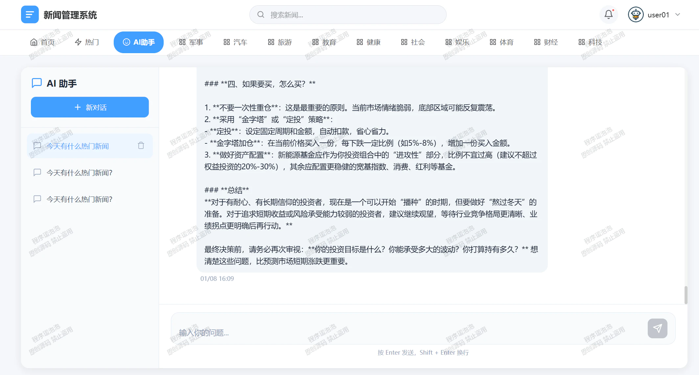
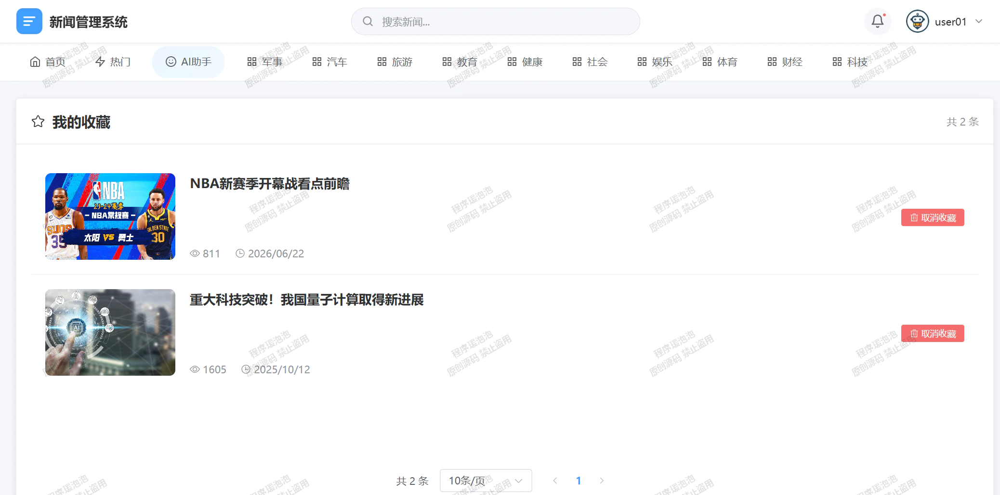
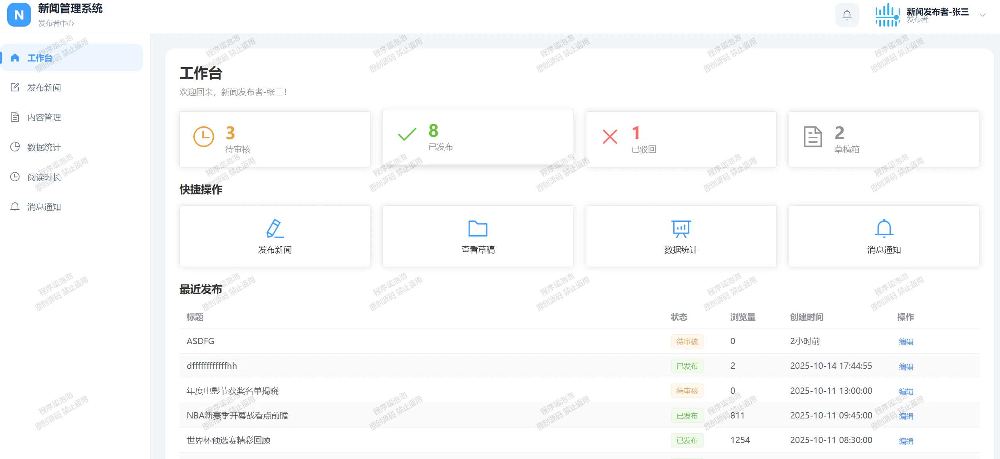
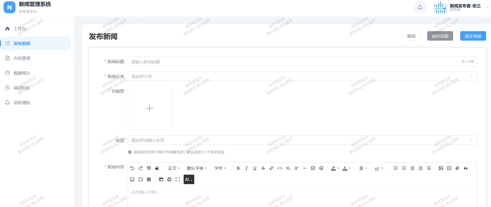
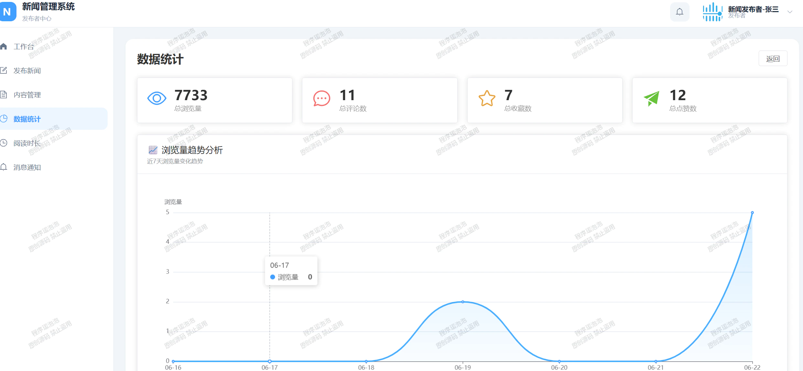
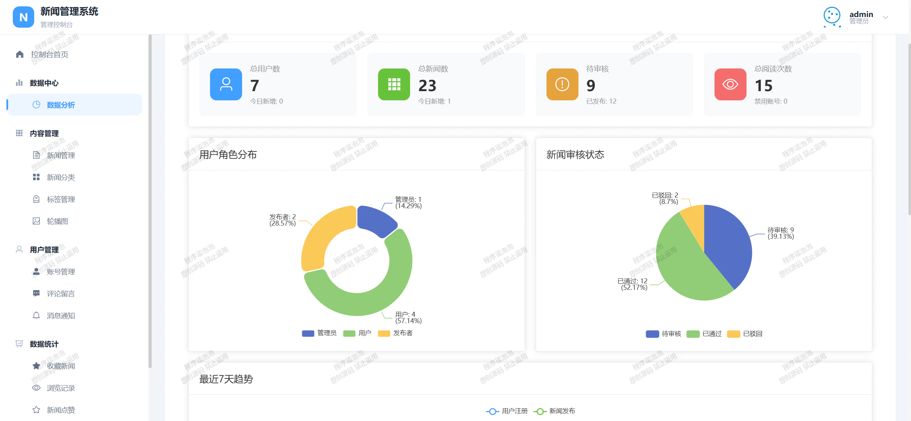
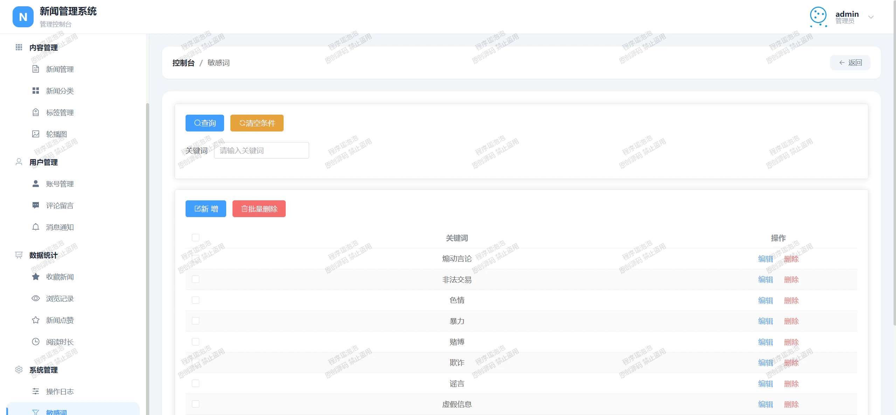
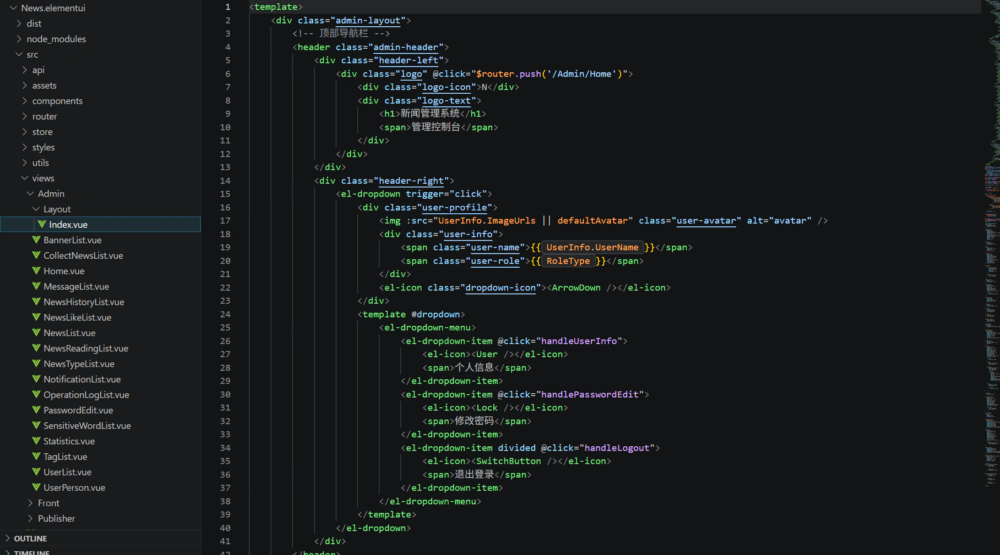

# news
新闻管理系统 亮点：AI问答、AI审核新闻、协同过滤算法、Echarts图形化分析、DFA算法缓存； 角色：用户、发布者、管理员；
所有源码均本人开发，项目是前后端分离的，所有的项目都具备了完整的业务逻辑，不仅仅局限于基础的增删改查（CRUD）操作，系统亮点众多。

本文注重于计算机毕业设计选题指导，列出题目均有源码， 大家可以去【公众号】(毕业终点站)获取或者加我【qq】(2112698948)提意见(别忘记Star哟)。备注：git

声明：仅用于学习使用，请勿用于任何商业行为！

1.系统非商用，非开源，非无偿。

2.由本人开发，如需源码，请联系以下方式，qq:2112698948。

3.项目有很多，并未全部上传，如果未找到想要的，可直接咨询。
# 新闻管理系统的设计与实现

> 新闻管理系统的设计与实现：基于 AI 问答、AI 审核新闻、协同过滤推荐、Echarts 图形化分析与 DFA 敏感词缓存的毕业设计项目。读者刷推荐、发布者发稿过审、管理员看大屏，三端协同。

## 一、系统亮点

| 亮点 | 实现方式 |
| --- | --- |
| AI 问答 | 接入大模型做新闻域问答，读者问背景直接给答案 |
| AI 审核新闻 | 发布者提交先过 AI 初审，敏感违规先拦一道再人工复核 |
| 协同过滤推荐 | 首页「热门推荐」与详情页「推荐阅读」按行为相似度出列表 |
| Echarts 图形化分析 | 发布者阅读时长、管理员多维数据大屏，全部用 Echarts 画 |
| DFA 算法缓存 | 敏感词建 DFA 状态机，热词命中缓存，长文本扫描快 |

## 二、技术栈

| 层 | 技术 |
| --- | --- |
| 前端 | Vue3、Vue Router、Pinia、Vite、Element-Plus、Axios、Sass |
| 后端 | Java、Spring Boot、MyBatis-Plus、JWT |
| 数据库 | MySQL 5.7 / 8.0、Navicat 12 |
| 算法 / 可视化 | 协同过滤、DFA 状态机、ECharts |
| 运行环境 | Win10 / Win11、JDK 17，IDEA 2025，VS Code |

## 三、核心截图

> 为防止截图被盗用，本文档仅展示 10 张核心页面，完整界面可拉取项目运行查看。

| 读者端 | 读者端 | 读者端 |
| --- | --- | --- |
|  |  |  |
|  |  |  |
|  |  |  |
|  |  |  |

## 四、功能模块一览

### 读者端
首页 · 新闻详情 · AI 问答 · 我的收藏 · 我的点赞 · 浏览历史。

### 发布者端
工作台 · 发布新闻 · 内容管理 · 数据分析 · 阅读时长 · 消息通知。

### 管理员端
数据分析 · 新闻管理 · 新闻分类 · 标签管理 · 轮播图管理 · 账号管理 · 评论留言 · 消息通知 · 收藏新闻 · 浏览记录 · 新闻点赞 · 阅读时长 · 敏感词管理。

## 五、核心算法说明

### 5.1 协同过滤推荐
首页「热门推荐」与详情页「推荐阅读」基于协同过滤：用读者浏览、收藏、点赞行为算相似度，补一份最可能感兴趣的新闻列表。

### 5.2 AI 审核新闻
发布者提交先过 AI 初审，对敏感、违规表述标注与拦截，再交管理员人工复核，减负又留痕。

### 5.3 DFA 敏感词缓存
敏感词建 DFA 状态机，匹配沿状态转移，热词命中结果缓存，长文本扫描不反复回溯。

### 5.4 Echarts 图形化分析
发布者看阅读时长分布，管理员看多维数据大屏，全部用 Echarts 渲染。

## 六、快速开始

1. 导入数据库：执行 `xxx.sql` 到 MySQL（库名按项目来）。
2. 配置后端：`application.yml` 中设置 MySQL 连接与大模型 Key（AI 问答 / AI 审核用）。
3. 启动后端：`mvn spring-boot:run`（需 JDK 17）。
4. 启动前端：`npm install && npm run dev`（Vue3）。

> 第三方密钥需自行申请，配置文件请勿提交到仓库。

